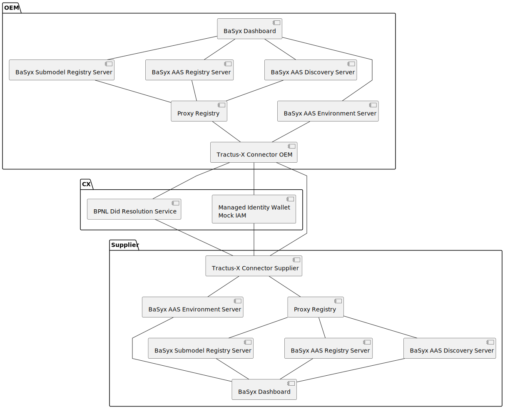

# Creating a local testing and development setup via Docker

This guide helps you to run PURIS for local demonstration and testing purposes. You can either choose to use
the "Extended Run Instructions" or to use the "Run with simplified Deployment Script".

**Prerequisites**

- [docker engine](https://docs.docker.com/engine/install/) (docker & docker compose) -> used for the setup
- [bruno](https://www.usebruno.com/downloads) -> used to interact with the components

## Additional information for Windows users

If you want to use the local setup on a Windows machine, it seems advisable to use the Windows subsystem for Linux (
WSL).
An installation guide can be found [here](https://learn.microsoft.com/en-us/windows/wsl/install).

Also see this [additional information about using Docker in combination with WSL2](https://docs.docker.com/desktop/wsl/)

> **ATTENTION** If you use an IDE it might change line endings leading to trouble with the docker container 
> execution scripts.

## Spin up all services.

```shell
cd deployment
sh deploy.sh -cl
```

Open new terminal to start basyx (can be done in parallel)
```shell
cd deployment/basyx
docker compose up 
```

Get logs of dcp / wallet mock and edcs in seperate window (optional)

```shell
cd deployment
docker compose -f docker-compose.yaml -f docker-compose-infrastructure.yaml logs -f mock-util-service \
                  edc-customer-control-plane edc-customer-data-plane edc-supplier-control-plane edc-supplier-data-plane
```

> If you don't care about what has been spinned up, go to the next chapter to run bruno.

### Architecture

The following components are deployed. The keycloak and databases are ommitted for readability reasons.



> **DISCLAIMER:**
>
> This repository is not production ready.
>
> A better maintained basic deployment is maintained in the [eclipse-tractusx/tractus-x-umbrella](https://github.com/eclipse-tractusx/tractus-x-umbrella)
>
> Currently, security is not considered. No access control has been used in the AAS related components.
>
> Instead of the mocked wallet one could use
> - the [ssi-dim-wallet-stub](https://github.com/eclipse-tractusx/ssi-dim-wallet-stub).
> - the [identity hub](https://github.com/eclipse-edc/IdentityHub) (TBD).
> 

#### docker compose edc

| Service Name                            | Service Port | Exposed Port |
|-----------------------------------------|--------------|--------------|
| puris-frontend-customer                 | 8080         | 3000         |
| puris-backend-customer                  | 8081         | 8081         |
| dtr-customer (_outcommented_)           | 4243         | 4243         |
| postgres-all                            | 5432         | 5433         |
| edc-customer-control-plane (API)        | 8180         | 8180         |
| edc-customer-control-plane (Management) | 8181         | 8181         |
| edc-customer-control-plane (??)         | 8182         | 8182         |
| edc-customer-control-plane (Control)    | 8183         | 8183         |
| edc-customer-control-plane (Protocol)   | 8184         | 8184         |
| edc-customer-data-plane (API)           | 8280         | 8280         |
| edc-customer-data-plane (Control)       | 8281         | 8281         |
| edc-customer-data-plane (DP Singaling)  | 8283         | 8283         |
| edc-customer-data-plane (Public API)    | 8285         | 8285         |
| edc-customer-data-plane (??)            | 8299         | 8299         |
| dtr-supplier (_outcommented_)           | 4243         | 4244         |
| edc-supplier-control-plane              | 9180         | 9180         |
| edc-supplier-control-plane              | 9181         | 9181         |
| edc-supplier-control-plane              | 9182         | 9182         |
| edc-supplier-control-plane              | 9183         | 9183         |
| edc-supplier-control-plane              | 9184         | 9184         |
| edc-supplier-control-plane              | 1044         | 1044         |
| edc-supplier-data-plane                 | 9280         | 9280         |
| edc-supplier-data-plane                 | 9281         | 9281         |
| edc-supplier-data-plane                 | 9283         | 9283         |
| edc-supplier-data-plane                 | 9285         | 9285         |
| edc-supplier-data-plane                 | 9299         | 9299         |

#### docker compose basyx

Note: the nginx are reverse proxies for the `aas-registry`, `sm-registry` and `aas-discovery`.

| Service Name           | Service Port | Exposed Port |
|------------------------|--------------|--------------|
| customer-aas-env       | 8081         | 8381         |
| customer-aas-registry  | 8080         | 8382         |
| customer-sm-registry   | 8080         | 8383         |
| customer-aas-discovery | 8081         | 8384         |
| customer-aas-web-ui    | 3000         | 3000         |
| customer-nginx         | 80           | 8385         |
| supplier-aas-env       | 8081         | 9381         |
| supplier-aas-registry  | 8080         | 9382         |
| supplier-sm-registry   | 8080         | 9383         |
| supplier-aas-discovery | 8081         | 9384         |
| supplier-aas-web-ui    | 3000         | 3001         |
| supplier-nginx         | 80           | 9385         |

## Run the demonstration

Storyline:

1. OEM and OEM both have an AAS for their instances that belong together
2. OEM creates a Quality Task and provides Fleet Vehicle information
3. Supplier analyzes the data and provides quality information
4. Supplier emits a notification as he found an issue (Out of Scope)

Use the bruno collection to do the following:

1. Provide Data -> This simulates the basis. The Control Unit and the Car have been manufactured.
   1. OEM: Create Car Twin with Fleet Vehicle Submodel
   2. OEM: Configure access to Registry and Submodel Repo in EDC for Supplier
   3. Supplier: Create Control Unit Twin with Manufactured Parts Quality Information Submodel
   4. Supplier: Configure access to Registry and Submodel Repo in EDC for OEM
2. Create Quality Task -> This is done when the partners want to monitor quality issues of the twins.
   1. OEM: Create Quality Task Twin with Fleet Vehicle Submodel
4. Supplier Consumes Data -> To analyze the quality issues, the supplier pulls information from the partner
   1. Contract both assets (Registry and Submodel Repo) and get access token
   2. Via EDC
      1. Identify the Quality Task Twin
      2. Identify the DSP Endpoint of the data
      3. Pull the actual data

> **NOTES**
> 
> The submodels have wrong cardinalities. The Fleet Vehicle information should normally be pulled from internal systems
> or other submodels when the quality task has been created. Thus, the fleet vehicle submodel would not be expected
> on the material twin - at least not as a list.
> Same applies to the quality task. It's designed for mass data, but here used as a single twin.

## NOTICE

This work is licensed under the [Apache-2.0](https://www.apache.org/licenses/LICENSE-2.0).

- SPDX-License-Identifier: Apache-2.0
- SPDX-FileCopyrightText: 2025 Fraunhofer ISST, Fraunhofer Institute for Software and Systems Engineering
- Source URL: https://github.com/FraunhoferISST/Quality-Use-Case-Demonstration
